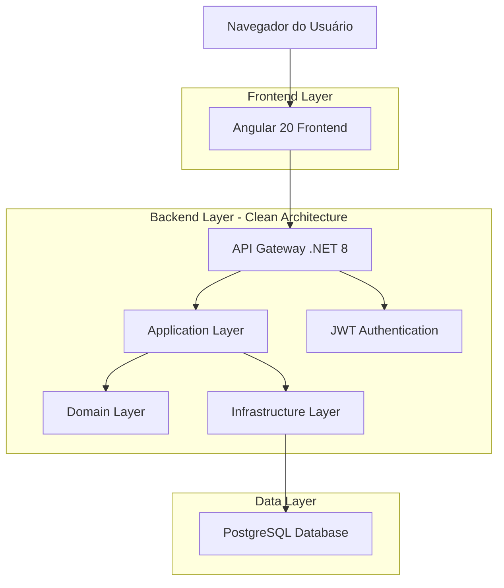
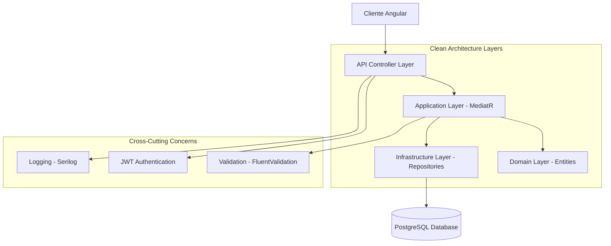
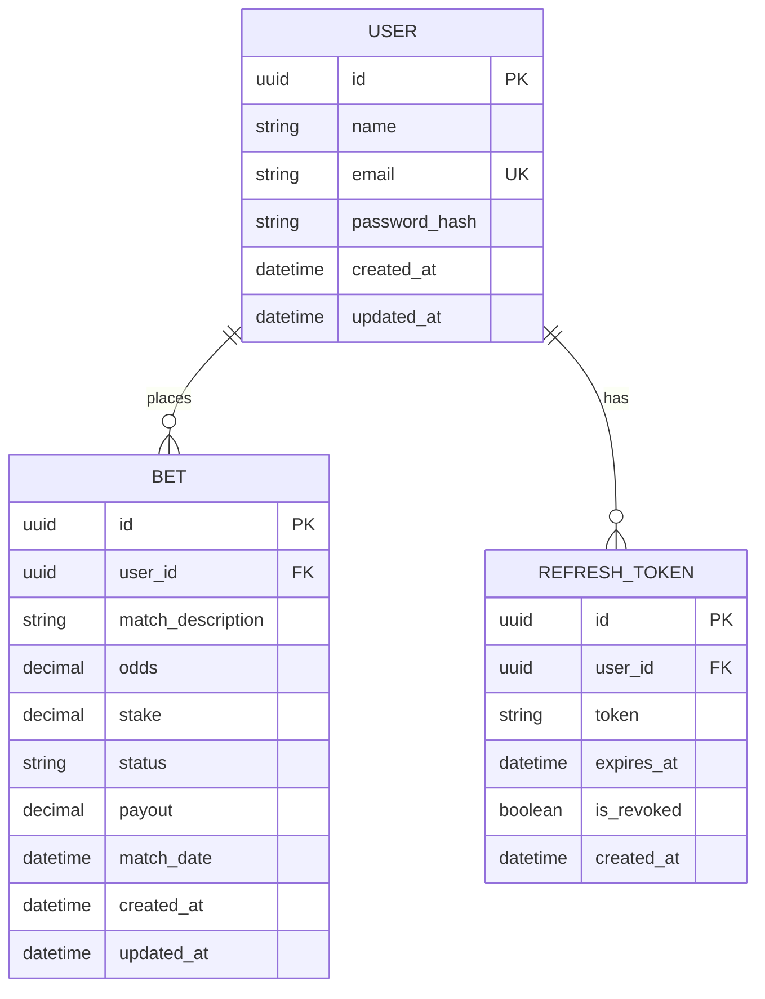

# Documento de Arquitetura Técnica - Sistema de Apostas de Futebol

## 1. Design da Arquitetura



## 2. Descrição das Tecnologias

* **Frontend**: Angular\@20 + TailwindCSS\@4 + TypeScript\@5

* **Backend**: .NET 8 + Entity Framework Core + FluentValidation + MediatR

* **Database**: PostgreSQL\@16

* **Authentication**: JWT + Refresh Tokens

* **Documentation**: Swagger/OpenAPI

* **Containerization**: Docker + Docker Compose

## 3. Definições de Rotas

| Rota           | Propósito                                     |
| -------------- | --------------------------------------------- |
| /login         | Página de autenticação do usuário             |
| /register      | Página de registro de novo usuário            |
| /dashboard     | Dashboard principal com estatísticas e resumo |
| /profile       | Página de perfil e configurações do usuário   |
| /bets          | Lista de todas as apostas do usuário          |
| /bets/create   | Formulário para criar nova aposta             |
| /bets/:id      | Detalhes de uma aposta específica             |
| /bets/:id/edit | Formulário para editar aposta existente       |

## 4. Definições da API

### 4.1 API Principal

**Autenticação de usuários**

```
POST /api/auth/login
```

Request:

| Nome do Parâmetro | Tipo   | Obrigatório | Descrição        |
| ----------------- | ------ | ----------- | ---------------- |
| email             | string | true        | Email do usuário |
| password          | string | true        | Senha do usuário |

Response:

| Nome do Parâmetro | Tipo    | Descrição                   |
| ----------------- | ------- | --------------------------- |
| accessToken       | string  | Token JWT para autenticação |
| refreshToken      | string  | Token para renovação        |
| user              | UserDto | Dados básicos do usuário    |

**Registro de usuários**

```
POST /api/auth/register
```

Request:

| Nome do Parâmetro | Tipo   | Obrigatório | Descrição                   |
| ----------------- | ------ | ----------- | --------------------------- |
| name              | string | true        | Nome completo do usuário    |
| email             | string | true        | Email único do usuário      |
| password          | string | true        | Senha (mínimo 8 caracteres) |

**Gerenciamento de apostas**

```
GET /api/bets
POST /api/bets
GET /api/bets/{id}
PUT /api/bets/{id}
DELETE /api/bets/{id}
```

**Dashboard e estatísticas**

```
GET /api/dashboard/stats
```

Response:

| Nome do Parâmetro   | Tipo   | Descrição                          |
| ------------------- | ------ | ---------------------------------- |
| totalBets           | number | Total de apostas realizadas        |
| winRate             | number | Taxa de acerto em percentual       |
| totalStake          | number | Valor total apostado               |
| totalProfit         | number | Lucro/prejuízo total               |
| roi                 | number | Return on Investment em percentual |
| monthlyDistribution | array  | Distribuição mensal dos resultados |

Exemplo de Request (Login):

```json
{
  "email": "usuario@email.com",
  "password": "minhasenha123"
}
```

## 5. Diagrama da Arquitetura do Servidor



## 6. Modelo de Dados

### 6.1 Definição do Modelo de Dados



### 6.2 Linguagem de Definição de Dados

**Tabela de Usuários (users)**

```sql
-- Criar tabela de usuários
CREATE TABLE users (
    id UUID PRIMARY KEY DEFAULT gen_random_uuid(),
    name VARCHAR(100) NOT NULL,
    email VARCHAR(255) UNIQUE NOT NULL,
    password_hash VARCHAR(255) NOT NULL,
    created_at TIMESTAMP WITH TIME ZONE DEFAULT NOW(),
    updated_at TIMESTAMP WITH TIME ZONE DEFAULT NOW()
);

-- Criar índices
CREATE INDEX idx_users_email ON users(email);
CREATE INDEX idx_users_created_at ON users(created_at DESC);

-- Dados iniciais
INSERT INTO users (name, email, password_hash) VALUES 
('João Silva', 'joao@email.com', '$2a$11$hashedpassword1'),
('Maria Santos', 'maria@email.com', '$2a$11$hashedpassword2');
```

**Tabela de Apostas (bets)**

```sql
-- Criar tabela de apostas
CREATE TABLE bets (
    id UUID PRIMARY KEY DEFAULT gen_random_uuid(),
    user_id UUID NOT NULL,
    match_description VARCHAR(500) NOT NULL,
    odds DECIMAL(10,2) NOT NULL CHECK (odds > 0),
    stake DECIMAL(10,2) NOT NULL CHECK (stake > 0),
    status VARCHAR(20) NOT NULL CHECK (status IN ('Pending', 'Won', 'Lost', 'Void')),
    payout DECIMAL(10,2) DEFAULT 0,
    match_date TIMESTAMP WITH TIME ZONE NOT NULL,
    created_at TIMESTAMP WITH TIME ZONE DEFAULT NOW(),
    updated_at TIMESTAMP WITH TIME ZONE DEFAULT NOW()
);

-- Criar índices
CREATE INDEX idx_bets_user_id ON bets(user_id);
CREATE INDEX idx_bets_status ON bets(status);
CREATE INDEX idx_bets_match_date ON bets(match_date DESC);
CREATE INDEX idx_bets_created_at ON bets(created_at DESC);

-- Dados iniciais de teste
INSERT INTO bets (user_id, match_description, odds, stake, status, payout, match_date) VALUES 
((SELECT id FROM users WHERE email = 'joao@email.com'), 'Flamengo vs Palmeiras - Flamengo Vence', 2.50, 100.00, 'Won', 250.00, '2024-01-15 20:00:00'),
((SELECT id FROM users WHERE email = 'joao@email.com'), 'Santos vs Corinthians - Mais de 2.5 Gols', 1.80, 50.00, 'Lost', 0.00, '2024-01-16 19:00:00'),
((SELECT id FROM users WHERE email = 'maria@email.com'), 'São Paulo vs Grêmio - Empate', 3.20, 75.00, 'Pending', 0.00, '2024-01-20 21:00:00');
```

**Tabela de Refresh Tokens (refresh\_tokens)**

```sql
-- Criar tabela de refresh tokens
CREATE TABLE refresh_tokens (
    id UUID PRIMARY KEY DEFAULT gen_random_uuid(),
    user_id UUID NOT NULL,
    token VARCHAR(500) NOT NULL,
    expires_at TIMESTAMP WITH TIME ZONE NOT NULL,
    is_revoked BOOLEAN DEFAULT FALSE,
    created_at TIMESTAMP WITH TIME ZONE DEFAULT NOW()
);

-- Criar índices
CREATE INDEX idx_refresh_tokens_user_id ON refresh_tokens(user_id);
CREATE INDEX idx_refresh_tokens_token ON refresh_tokens(token);
CREATE INDEX idx_refresh_tokens_expires_at ON refresh_tokens(expires_at);

-- Configurar permissões Supabase (se aplicável)
GRANT SELECT ON users TO anon;
GRANT ALL PRIVILEGES ON users TO authenticated;
GRANT SELECT ON bets TO anon;
GRANT ALL PRIVILEGES ON bets TO authenticated;
GRANT ALL PRIVILEGES ON refresh_tokens TO authenticated;
```

**Trigger para atualização automática de timestamps**

```sql
-- Função para atualizar updated_at
CREATE OR REPLACE FUNCTION update_updated_at_column()
RETURNS TRIGGER AS $$
BEGIN
    NEW.updated_at = NOW();
    RETURN NEW;
END;
$$ language 'plpgsql';

-- Triggers para as tabelas
CREATE TRIGGER update_users_updated_at BEFORE UPDATE ON users
    FOR EACH ROW EXECUTE FUNCTION update_updated_at_column();

CREATE TRIGGER update_bets_updated_at BEFORE UPDATE ON bets
    FOR EACH ROW EXECUTE FUNCTION update_updated_at_column();
```

