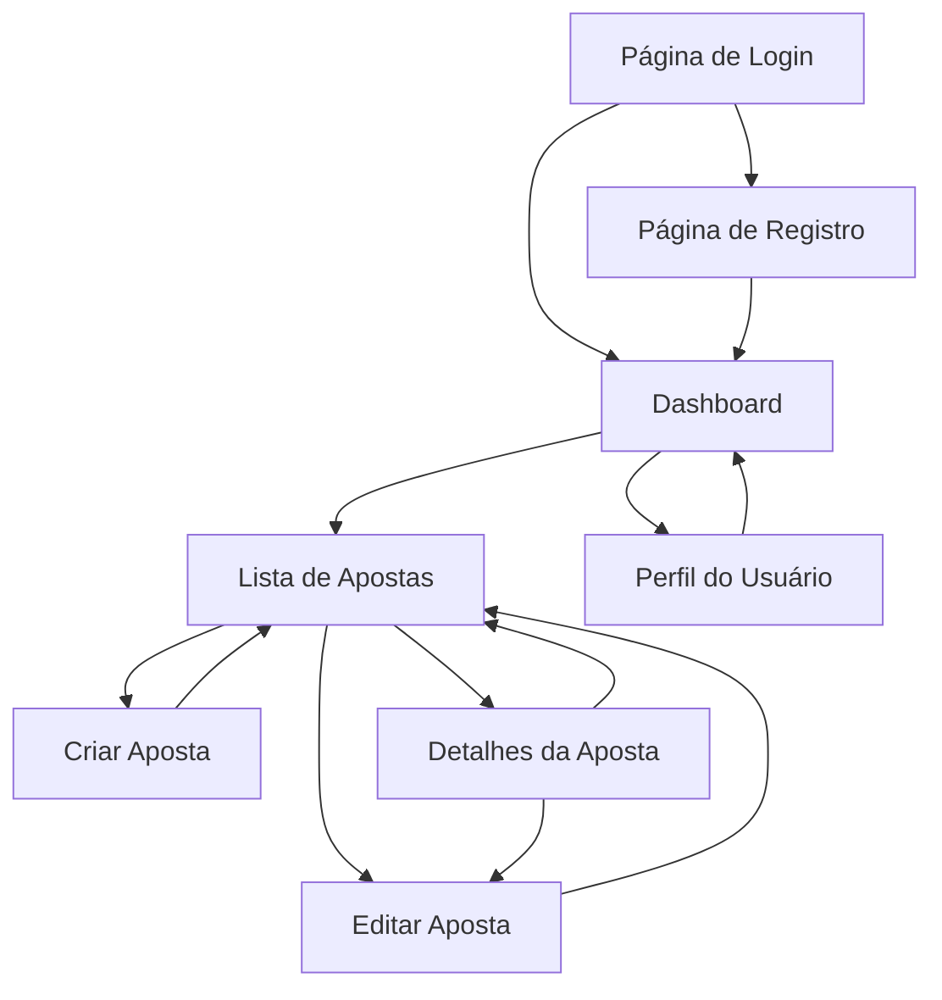

# Documento de Requisitos do Produto - Sistema de Apostas de Futebol

## 1. Visão Geral do Produto

Sistema web completo para gerenciamento pessoal de apostas de futebol, permitindo registro, acompanhamento e análise de performance das apostas realizadas.

O produto resolve o problema de controle e análise de apostas esportivas, oferecendo ao usuário uma plataforma centralizada para monitorar seu desempenho, calcular ROI e tomar decisões mais informadas sobre suas apostas futuras.

O objetivo é fornecer uma ferramenta profissional que ajude apostadores a manter disciplina financeira e melhorar seus resultados através de dados e estatísticas detalhadas.

## 2. Funcionalidades Principais

### 2.1 Papéis de Usuário

| Papel              | Método de Registro         | Permissões Principais                                       |
| ------------------ | -------------------------- | ----------------------------------------------------------- |
| Usuário Registrado | Registro por email e senha | Acesso completo às suas apostas, perfil e dashboard pessoal |

### 2.2 Módulo de Funcionalidades

Nossos requisitos consistem nas seguintes páginas principais:

1. **Página de Login**: formulário de autenticação, link para registro, recuperação de senha.
2. **Página de Registro**: formulário de cadastro, validações, confirmação de email.
3. **Dashboard**: cards de estatísticas, gráficos de performance, lista de apostas recentes, filtros por período.
4. **Perfil do Usuário**: visualização e edição de dados pessoais, alteração de senha.
5. **Lista de Apostas**: tabela com todas as apostas, filtros, paginação, ações de editar/excluir.
6. **Criar/Editar Aposta**: formulário completo para cadastro e edição de apostas.
7. **Detalhes da Aposta**: visualização completa dos dados de uma aposta específica.

### 2.3 Detalhes das Páginas

| Nome da Página      | Nome do Módulo             | Descrição da Funcionalidade                                       |
| ------------------- | -------------------------- | ----------------------------------------------------------------- |
| Login               | Formulário de Autenticação | Validar credenciais, gerar JWT tokens, redirecionamento pós-login |
| Login               | Links de Navegação         | Acesso para registro e recuperação de senha                       |
| Registro            | Formulário de Cadastro     | Coletar dados do usuário, validar email único, criptografar senha |
| Registro            | Validações                 | Verificar força da senha, formato do email, campos obrigatórios   |
| Dashboard           | Cards de Estatísticas      | Exibir total de apostas, taxa de acerto, stake total, ROI, lucro  |
| Dashboard           | Gráfico de Performance     | Visualizar evolução mensal dos resultados                         |
| Dashboard           | Lista de Apostas Recentes  | Mostrar últimas 5-10 apostas com status e valores                 |
| Dashboard           | Filtros de Período         | Permitir análise por mês, trimestre, ano                          |
| Perfil              | Dados Pessoais             | Visualizar e editar nome, email, informações do usuário           |
| Perfil              | Segurança                  | Alterar senha com validação da senha atual                        |
| Lista de Apostas    | Tabela de Apostas          | Listar todas as apostas com paginação e ordenação                 |
| Lista de Apostas    | Filtros Avançados          | Filtrar por status, período, valor, odds                          |
| Lista de Apostas    | Ações CRUD                 | Botões para criar, editar, excluir e visualizar apostas           |
| Criar/Editar Aposta | Formulário Principal       | Campos para jogo, odds, stake, resultado, data                    |
| Criar/Editar Aposta | Cálculos Automáticos       | Calcular payout automaticamente baseado em odds e stake           |
| Detalhes da Aposta  | Visualização Completa      | Mostrar todos os dados da aposta de forma organizada              |
| Detalhes da Aposta  | Ações Contextuais          | Botões para editar ou excluir a aposta                            |

## 3. Processo Principal

**Fluxo do Usuário:**

1. **Registro/Login**: Usuário se cadastra ou faz login no sistema
2. **Dashboard**: Acessa a tela principal com resumo de suas apostas
3. **Gerenciamento de Apostas**: Cria, edita ou visualiza suas apostas
4. **Análise de Performance**: Utiliza filtros e gráficos para analisar resultados
5. **Perfil**: Gerencia suas informações pessoais quando necessário

## 4. Design da Interface do Usuário

### 4.1 Estilo de Design

* **Cores Primárias**: Verde (#10B981) para sucesso/ganhos, Vermelho (#EF4444) para perdas

* **Cores Secundárias**: Azul (#3B82F6) para ações principais, Cinza (#6B7280) para textos secundários

* **Estilo de Botões**: Arredondados (rounded-lg) com efeitos de hover e transições suaves

* **Fonte**: Inter ou system fonts, tamanhos de 14px a 24px

* **Layout**: Card-based com navegação superior, sidebar opcional em desktop

* **Ícones**: SVG customizados ou ícones simples em CSS, sem bibliotecas externas

### 4.2 Visão Geral do Design das Páginas

| Nome da Página       | Nome do Módulo        | Elementos da UI                                                                                 |
| -------------------- | --------------------- | ----------------------------------------------------------------------------------------------- |
| Login                | Formulário Central    | Card centralizado, inputs com bordas arredondadas, botão principal verde, fundo gradiente sutil |
| Dashboard            | Cards de Estatísticas | Grid responsivo 2x2 em mobile, 4x1 em desktop, cores baseadas em performance                    |
| Dashboard            | Gráfico               | SVG simples com linhas e pontos, animações CSS para entrada                                     |
| Lista de Apostas     | Tabela Responsiva     | Cards em mobile, tabela em desktop, cores de status, botões de ação compactos                   |
| Formulário de Aposta | Layout em Coluna      | Inputs organizados verticalmente, labels flutuantes, validação visual                           |

### 4.3 Responsividade

O produto é mobile-first com adaptação progressiva para desktop. Inclui otimizações para touch (botões maiores, espaçamento adequado) e navegação por gestos em dispositivos móveis.

**Breakpoints:**

* Mobile: até 768px

* Tablet: 768px a 1024px

* Desktop: acima de 1024px

